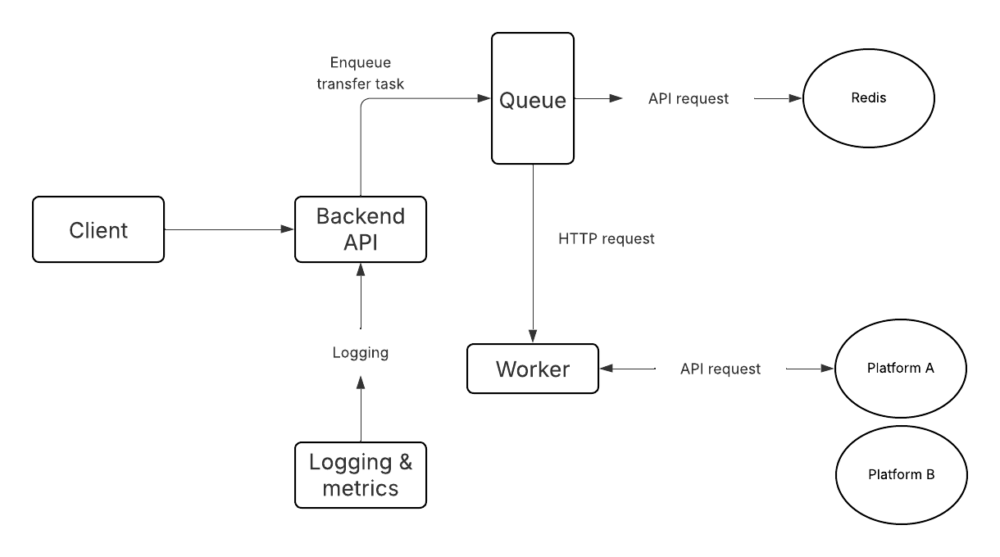

# Crossplay

A **scalable backend system** for transferring playlists across multiple music streaming platforms such as Spotify and Apple Music. Designed with **concurrency, caching, and fault tolerance** in mind.

---

## Features

- **Backend API**: Handles playlist transfer requests with structured endpoints.
  - `POST /transfer` – Start a playlist transfer
  - `GET /status/:id` – Check progress/status
  - `GET /playlists` – List user playlists
  - `POST /connect/:platform` – Authenticate/connect user

- **Concurrent Processing**: High-throughput transfer engine using worker queues and parallel track processing.

- **Rate Limiting & Retry**: Handles third-party API limits with **exponential backoff** and retries.

- **Caching**: 
  - OAuth tokens cached for multiple platforms
  - Track metadata cached to reduce API calls
  - Efficient deduplication of tracks across playlists

- **Scalable & Fault-Tolerant**:
  - Supports multiple worker nodes
  - Persistent state allows resuming interrupted transfers

- **Logging & Metrics**: Structured logging for monitoring performance, errors, and throughput.

---

## Architecture



**Flow Overview**:

1. Client sends a transfer request to the Backend API.
2. Backend API adds the task to a Job Queue.
3. Worker nodes process playlist transfers concurrently.
4. Workers interact with:
   - Third-party Music APIs (Spotify, Apple Music)
   - Redis cache for tokens and track metadata
5. Logging and metrics provide real-time monitoring of the system.

---

## Installation

1. Clone the repository:
```bash
git clone git@github.com:braeniac/crossplay-api.git
cd crossplay-api
```

2. Install dependencies:
```bash
npm install
```

3. Configure environment variables (.env):
```
SPOTIFY_CLIENT_ID=your_spotify_client_id
SPOTIFY_CLIENT_SECRET=your_spotify_client_secret
APPLE_MUSIC_KEY=your_apple_music_key
REDIS_URL=redis://localhost:6379

```

4. Start Redis (if using locally):
```bash
redis-server
```

5. Run the backend server
```bash
npm run dev
```